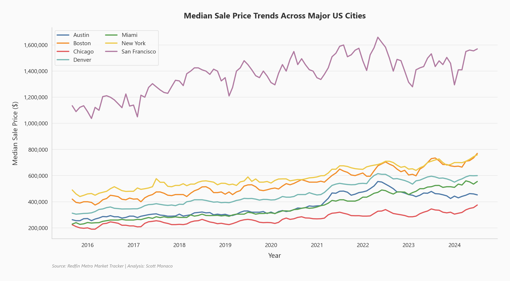
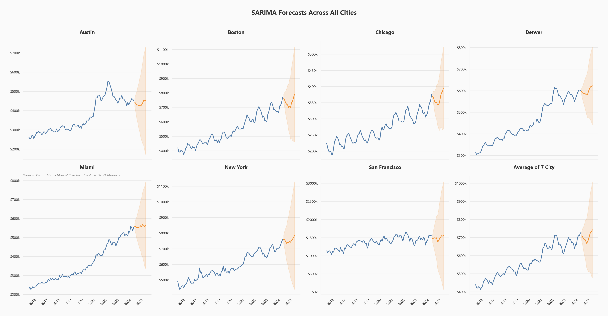
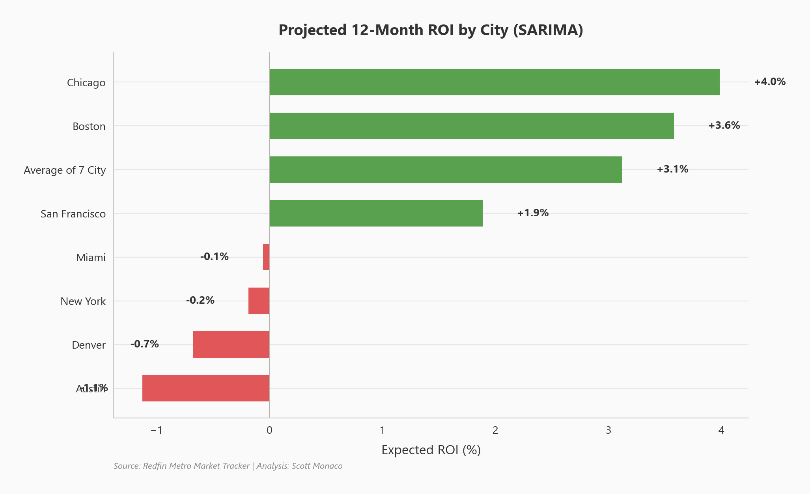
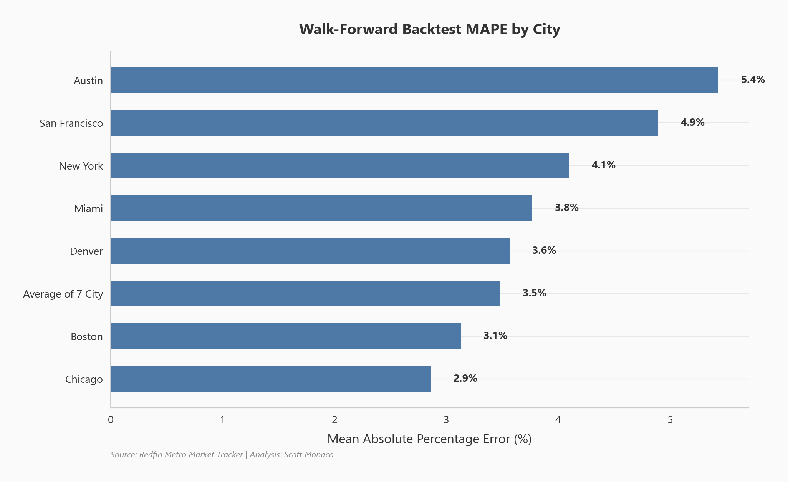

# Real Estate Price Prediction (SARIMA)

SARIMA time series models forecasting median sale prices across seven U.S. cities, deployed as an interactive Streamlit dashboard.

## Key Finding



*Median home sale prices across seven major U.S. metros show diverging trajectories since 2020, with coastal markets like San Francisco experiencing sharp post-pandemic corrections while cities like Miami and Boston hold elevated price levels.*

## Problem Statement

Home buyers, investors, and analysts need forward-looking price estimates to make informed decisions about when and where to buy. Manual forecasting is subjective and doesn't scale across markets. This project automates the process by building city-specific SARIMA models on monthly Redfin data, automatically selecting optimal parameters, and validating accuracy through walk-forward backtesting — giving users data-driven 12-month price forecasts for seven major metros.

## Overview

The pipeline downloads monthly median sale price data from the Redfin Metro Market Tracker, fits seasonal ARIMA models using `pmdarima.auto_arima` for automatic parameter selection, and deploys results through a Streamlit dashboard where users can select cities, adjust forecast horizons, and explore model diagnostics.

**Cities analyzed:** Austin, Boston, Chicago, Denver, Miami, New York, San Francisco

## Analysis & Findings

### Price Forecasts



*12-month SARIMA forecasts with 95% confidence intervals for all seven cities plus the composite average. Forecast lines (orange) extend from the last observed data point, with shaded bands showing prediction uncertainty.*

The models capture seasonal price patterns and produce forecasts that account for each city's unique market dynamics. Confidence intervals widen over time, reflecting increasing uncertainty at longer horizons.

### ROI Analysis



*Projected 12-month return on investment by city, calculated as the percentage change from the last observed price to the forecast endpoint.*

ROI projections identify which markets offer the most favorable entry points based on model predictions. Cities with positive ROI suggest expected price appreciation, while negative ROI cities may be heading into correction territory.

### Model Validation

Models are validated using expanding-window walk-forward backtesting: train on 60+ months of data, forecast the next 12 months, step forward 6 months, and repeat. This simulates real-world forecast conditions where the model only sees past data.



*Walk-forward backtest Mean Absolute Percentage Error (MAPE) by city. Lower values indicate more accurate historical forecasts.*

## Tools & Technologies

- **Language:** Python
- **Time Series:** statsmodels (SARIMAX), pmdarima (auto_arima)
- **Dashboard:** Streamlit, Plotly
- **Data Processing:** Pandas, NumPy
- **Static Charts:** Matplotlib, Seaborn
- **Data Source:** [Redfin Metro Market Tracker](https://www.redfin.com/news/data-center/)

## Live App

Try the interactive forecast tool: [Real Estate Predictions on Streamlit](https://real-estate-predictions-5zubghkpzgc54tocbxw3dc.streamlit.app/)

---

## Replication Guide

### Setup

```bash
pip install -r requirements.txt
```

### Refresh Data

Downloads the latest Redfin metro market data (~200 MB) and outputs `data/data_for_prediction.csv`:

```bash
python data/refresh_data.py
```

### Run the Dashboard

```bash
streamlit run app.py
```

### Regenerate Charts

Produces 17 themed charts saved to `charts/` and the portfolio site image directory:

```bash
python generate_themed_charts.py
```

### Project Structure

```
real-estate-predictions/
├── app.py                     # Streamlit dashboard (single-page)
├── data/
│   ├── refresh_data.py        # Data download & prep pipeline
│   └── data_for_prediction.csv
├── src/
│   ├── config.py              # Constants, city lists, colors
│   ├── data_loader.py         # Cached data loading
│   ├── model.py               # SARIMA training, prediction, backtesting
│   └── charts.py              # Plotly chart factories
├── generate_themed_charts.py  # Static chart generation for portfolio
├── charts/                    # Generated chart PNGs
├── notebooks/                 # Original exploration notebooks
├── .streamlit/config.toml     # Theme configuration
├── requirements.txt
└── README.md
```

## Updating the Model

Run the following every ~6 months to refresh data and retrain models:

1. **Download fresh data:** `python data/refresh_data.py` — pulls the latest Redfin data and overwrites the CSV
2. **Verify data range:** check the output confirms the date range extends to the current month
3. **Regenerate charts:** `python generate_themed_charts.py` — updates all 17 portfolio charts with new forecasts and backtest results
4. **Test the dashboard:** `streamlit run app.py` — models retrain automatically on the new data (cached after first run)
5. **Deploy:** push changes and redeploy the Streamlit app

## View Full Analysis

For the complete writeup with all charts and methodology, visit the [project page on scottmonaco.com](https://scottmonaco.com/real-estate-prediction).
